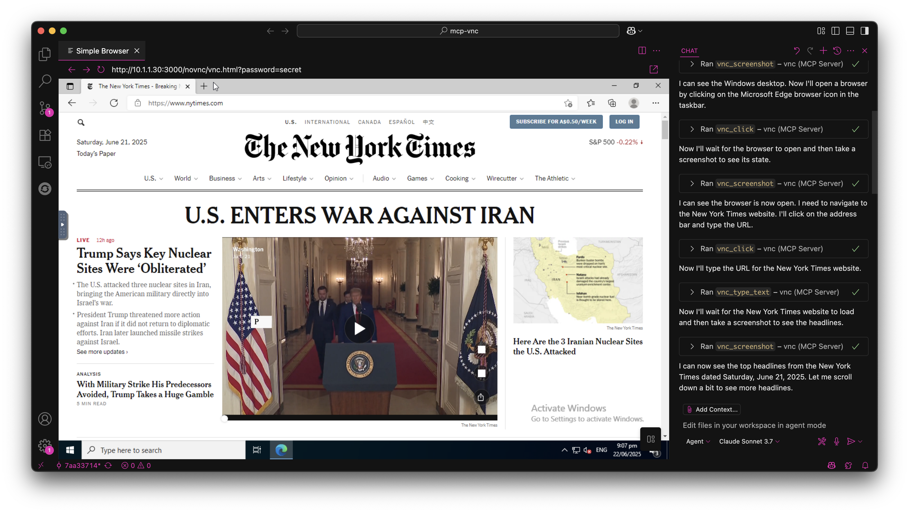

# 💻 mcp-vnc

[](https://nodejs.org)
[](LICENSE)
[](https://badge.fury.io/js/@hrrrsn%2Fmcp-vnc)

A [Model Context Protocol (MCP)](https://modelcontextprotocol.io/introduction) server that enables AI agents to remotely control Windows, Linux, macOS or anything else that can run a VNC server (don't worry, it's probably fine).



## 🚀 Quick Start

### Install from NPM

```bash
npm install -g @hrrrsn/mcp-vnc
```

### Install from Source

```bash
git clone https://github.com/hrrrsn/mcp-vnc
cd mcp-vnc
npm install
npm run build
```

## ⚙️ Configuration

### Claude Desktop

1. Locate and open your Claude Desktop configuration file:
   - **macOS**: `~/Library/Application Support/Claude/claude_desktop_config.json`
   - **Windows**: `%APPDATA%\Claude\claude_desktop_config.json`
   - **Linux**: `~/.config/Claude/claude_desktop_config.json`

2. Add the following configuration:

**Using NPM Install:**
```json
{
  "mcpServers": {
    "vnc-controller": {
      "type": "stdio",
      "command": "mcp-vnc",
      "env": {
        "VNC_HOST": "192.168.1.100",
        "VNC_PORT": "5900",
        "VNC_PASSWORD": "your-vnc-password"
      }
    }
  }
}
```

**Built from Source:**
```json
{
  "mcpServers": {
    "vnc-controller": {
      "type": "stdio",
      "command": "node",
      "args": ["dist/index.js"],
      "cwd": "/path/to/mcp-vnc",
      "env": {
        "VNC_HOST": "192.168.1.100",
        "VNC_PORT": "5900",
        "VNC_PASSWORD": "your-vnc-password"
      }
    }
  }
}
```

### VS Code

Please refer to the [VS Code documentation](https://code.visualstudio.com/docs/copilot/chat/mcp-servers)

## 🛠️ Available Tools

The MCP server provides the following tools for remote desktop control:

### 🖱️ Mouse Control

<details>
<summary><strong>vnc_click</strong> - Click at specified coordinates</summary>

| Parameter | Required | Type | Description | Default |
|-----------|----------|------|-------------|---------|
| `x` | ✅ | number | X coordinate | - |
| `y` | ✅ | number | Y coordinate | - |
| `button` | ❌ | string | Mouse button (`left`, `right`, `middle`) | `left` |
| `double` | ❌ | boolean | Double-click instead of single click | `false` |

**Example:** `vnc_click(x=100, y=200, button="right", double=true)`
</details>

<details>
<summary><strong>vnc_move_mouse</strong> - Move mouse cursor</summary>

| Parameter | Required | Type | Description |
|-----------|----------|------|-------------|
| `x` | ✅ | number | X coordinate |
| `y` | ✅ | number | Y coordinate |

**Example:** `vnc_move_mouse(x=500, y=300)`
</details>

### ⌨️ Keyboard Control

<details>
<summary><strong>vnc_key_press</strong> - Send keys and key combinations</summary>

| Parameter | Required | Type | Description |
|-----------|----------|------|-------------|
| `key` | ✅ | string | Key or key combination to press |

**Supported Keys:**
- **Single keys**: `a`, `Enter`, `F1`, `Escape`, `Up`, `Down`, `Tab`, `Space`
- **Key combinations**: `Ctrl+c`, `Alt+F4`, `Ctrl+Alt+Delete`, `Shift+Tab`
- **Modifiers**: `Ctrl`, `Alt`, `Shift`, `Super`/`Win`, `Meta`/`Cmd`

**Examples:** 
- `vnc_key_press(key="Enter")`
- `vnc_key_press(key="Ctrl+Alt+Delete")`
</details>

### 📝 Text Input

<details>
<summary><strong>vnc_type_text</strong> - Type single-line text</summary>

| Parameter | Required | Type | Description | Default |
|-----------|----------|------|-------------|---------|
| `text` | ✅ | string | Text to type | - |
| `enter` | ❌ | boolean | Press Enter after typing | `false` |

**Example:** `vnc_type_text(text="Hello World!", enter=true)`
</details>

<details>
<summary><strong>vnc_type_multiline</strong> - Type multiple lines</summary>

| Parameter | Required | Type | Description |
|-----------|----------|------|-------------|
| `lines` | ✅ | string[] | Array of lines to type |

**Example:** `vnc_type_multiline(lines=["Line 1", "Line 2", "Line 3"])`
</details>

### 📸 Screen Capture

<details>
<summary><strong>vnc_screenshot</strong> - Capture screen</summary>

| Parameter | Required | Type | Description | Default |
|-----------|----------|------|-------------|---------|
| `delay` | ❌ | number | Delay before screenshot (0-300000ms) | `0` |

**Example:** `vnc_screenshot(delay=1000)` - Wait 1 second before capture
</details>

## 🤝 Contributing

Contributions are welcome! Please feel free to submit a Pull Request.

## 📄 License

This project is licensed under the MIT License - see the [LICENSE](LICENSE) file for details.